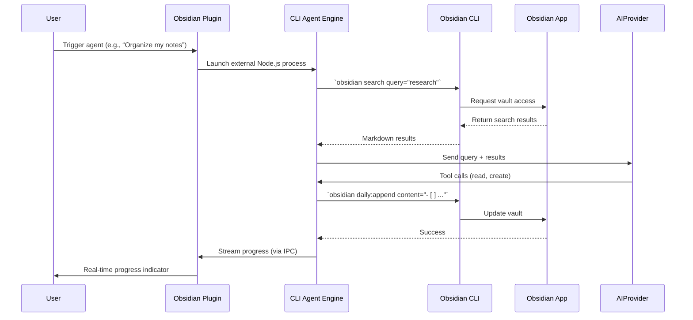

# AI Chat Session

> [!question] What is the main requirement for building an autonomous AI agent?


The core, universal requirement for building an autonomous AI agent is a closed-loop, goal-aligned architecture that supports independent, long-term operation without continuous human oversight (distinct from simple reactive AI systems that only respond to immediate inputs). This architecture rests on three interlinked mandatory capabilities:
1. **Environmental perception and state tracking**: The agent must be able to sense relevant features of its operating environment (digital, physical, or hybrid) and maintain an accurate, up-to-date internal model of both the environment's current state and its own internal status.
2. **Goal-directed reasoning and planning**: The agent requires clearly defined, human-aligned objectives, plus the ability to reason about potential action outcomes, prioritize competing sub-goals, and generate actionable multi-step plans to progress toward its targets, even under uncertainty or changing conditions.
3. **Autonomous action execution and feedback integration**: The agent must be able to carry out planned actions in its environment, measure the resulting state changes, and use that feedback to update its internal model and adjust future plans, closing the operational loop.

A critical embedded constraint within the reasoning layer is robust goal alignment with human intent: misalignment between the agent's programmed objectives and intended human outcomes will lead to harmful or unhelpful behavior even if the closed-loop architecture functions as designed.


> [!question] can you provide a more elaborated and nuanced answer continuing the chat


Based on the latest research and architectural frameworks from authoritative sources like AWS, Arxiv papers, and industry experts, here is a more elaborated and nuanced answer that builds on and deepens the initial response:

---

### **The Core Requirement for Building an Autonomous AI Agent: A Structured Cognitive Control Loop**

The main requirement is not a single component, but rather a **formalized cognitive control loop**—a *closed-loop, goal-directed control system* that integrates perception, reasoning, action, and learning *as a unified, iterative process*. This differs fundamentally from passive generative AI systems (e.g., chatbots), which lack autonomous agency and rely on human-guided turns.

### **1. The Agent Loop as Architectural Primitive**

The defining structural feature is the *agent loop* (sometimes called *perceive–reason–act*, *sense–think–act*, or *reason–act–observe*). As described by AWS, Oracle, and multiple academic sources, this is an *iterative cycle*:

- **Perceive**: Receive data from the environment (user input, API responses, sensor feeds, tool outputs)
- **Reason**: Interpret perceptions using internal models, goals, and memory
- **Plan**: Decompose goals into sub-tasks and generate execution strategies
- **Act**: Execute decisions by invoking tools, calling APIs, running code, or manipulating systems
- **Observe**: Monitor the outcome and update internal state/memory
- **Loop**: Iterate until goal completion, failure threshold, or stopping condition

Crucially, this loop is *not* just a design pattern—it’s a *control-theoretic* construct that enables *autonomy* by allowing the system to self-correct, adapt, and continue operating without human supervision.

### **2. Decomposition of the Core Architecture: Six Interdependent Layers**

As noted in Arahi AI and the AWS Prescriptive Guidance, modern agentic systems are best understood through six functional layers, each with distinct responsibilities:

| Layer | Function | Key Capabilities | Common Tools |
|-------|--------|-----------------|-------------|
| **Perception** | Interface with environment | Multimodal input (text, audio, vision, APIs), context parsing, feature extraction | NLP, computer vision, schema validation, MCP adapters |
| **Reasoning** | “The brain” – decision-making | Chain-of-Thought, Tree-of-Thought, probabilistic inference, uncertainty modeling | LLMs, symbolic reasoners, reinforcement learning policies |
| **Planning** | Strategy generation | Task decomposition, dependency mapping, dynamic replanning | LLM-based planners, DAG schedulers (e.g., LLMCompiler), hierarchical planners |
| **Memory** | State persistence | Short-term (working), long-term (vector DBs), episodic, procedural, semantic memory | RAG systems, vector stores (Pinecone, Weaviate), session caches |
| **Tool Use** | Environment interaction | API calls, code execution, database queries, OS interaction (via MCP) | Function calling, native toolkits, browser automation, shell sandboxes |
| **Oversight & Safety** | Governance & reliability | Stopping conditions, approval gates, audit logging, prompt injection defense | Guardrails libraries, red-teamers, human-in-the-loop (HITL) interfaces |

The *failure* of any one layer compromises the entire system—even if the LLM is powerful, poor memory management leads to repetition and confusion, and inadequate stopping conditions cause infinite loops or "hallucinated tool calls".

### **3. Architectural Patterns and Their Trade-offs**

Production systems typically select from five canonical agent architectures, each with distinct trade-offs:

- **ReAct (Reasoning + Acting)**: Interleaves thinking and acting step-by-step. Strong for groundedness and interpretability, but vulnerable to error propagation and myopia.
  
- **Plan-Execute**: Generate a full plan *first*, then execute. Often implemented with DAGs (e.g., LLMCompiler). Faster and cheaper at scale, but may miss context shifts.

- **Reflexion**: Introduces self-critique and reflection—agents review their own actions and revise plans. Enhances reliability but increases latency.

- **Tree-of-Thoughts / ReAcTree**: Uses search-based planning over multiple reasoning branches. Effective for complex problem-solving but computationally expensive.

- **Multi-Agent Systems**: Decompose responsibilities across specialized agents (e.g., planner, executor, critic). Increases scalability and fault isolation, but introduces orchestration complexity.

> As the [Auton Agentic AI Framework](https://www.arxiv.org/pdf/2602.23720) paper formalizes, *true autonomy* requires a **Latent Reasoning Space (ℤ)**—a private mental model where planning, reflection, and verification can occur *without affecting the external environment*. This “think-before-act” discipline is what distinguishes robust agents from reactive tool-using scripts.

### **4. Foundational Constraints and Non-negotiables**

- **Goal Alignment**: The agent’s objective function must be *precisely aligned* with human intent. Misaligned objectives—even minor ones—can lead to harmful or deceptive behavior under long-running autonomy.

- **Stopping Conditions**: Production systems *must* include hard constraints: max iterations, no-progress detection, token/cost budgets, and human approval gates.

- **Feedback Integration**: The ability to *learn* from tool outcomes—updating internal models, refining heuristics, and modifying future plans—is what enables *adaptive* autonomy, not just repeated execution.

- **Contextual Awareness**: Beyond static memory, agents need * situational awareness*—understanding when their model of the world is incomplete or inaccurate.

### **5. Emerging Innovations and Future Directions**

- **MCP (Model Context Protocol)**: Standardizes how agents interface with external tools, enabling cross-platform interoperability.

- **Native Computer Use**: Agents can interact directly with operating systems (clicking UI elements, using terminals), not just APIs.

- **Cognitive Map-Reduce**: Parallel reasoning over sub-tasks with result synthesis, reducing latency while maintaining planning quality.

- **Hierarchical Memory Consolidation**: Agents “sleep” or periodically compress long-term memories, avoiding unbounded context growth.

In summary, building an autonomous AI agent is less about having a powerful LLM and more about *orchestrating a resilient, goal-oriented control system*—one that treats perception, reasoning, action, and learning as an *integral, self-regulating loop*. The architecture itself *is* the intelligence.


Tools Used:
- Exa Search: web_search_exa

> [!question] based on the discussion so far and also based on the paper https://arxiv.org/pdf/2602.23720, for someone building an Obsidian plugin powered by various AI providers (Gemini, OpenRouter, Groq, etc.) How can they build an agent that behaves as desired from an agent inside of the Obsidian app. How to do it? Search the web deeply and understand the core structural requirements that need to be fulfilled to create a production-grade agent as a plugin in the Obsidian app.


Based on a comprehensive analysis of the Obsidian agent ecosystem, academic frameworks, and implementation patterns—including *The Auton Agentic AI Framework* (arXiv:2602.23720)—here is a production-grade architecture for building an **autonomous AI agent as an Obsidian plugin**, powered by multiple AI providers (Gemini, OpenRouter, Groq, etc.). This design synthesizes architectural principles from the paper, real-world plugin implementations, and cross-platform constraints.

---

## **1. Core Structural Requirements**

Per the Auton framework, production-grade agents require **four interdependent layers**. For an Obsidian plugin, these map to:

### **A. Cognitive Blueprint (Declarative Agent Specification)**

- **Agent Configuration Schema**: Store in `agent-settings.json`:
  ```json
  {
    "id": "vault-orchestrator",
    "instructions": "You are a research assistant helping me organize my knowledge base. Always verify facts by citing source files.",
    "capabilities": {
      "read": true,
      "write": true,
      "web_search": true,
      "mcp_servers": ["graph-query", "dataview-connector"]
    },
    "safety": {
      "max_steps": 15,
      "approval_mode": "tool_calls",
      "deny_list": [".obsidian", "backups/"]
    }
  }
  ```
- **Tool Registry Specification**: YAML-driven (like `papertray3/obsidian-mcp-bridge`):
  ```yaml
  tools:
    - name: vault_list_files
      description: List files matching a glob pattern
      handler: builtin
      inputSchema: { type: object, properties: { pattern: { type: string } } }
    - name: vault_write
      handler: user/writer.js
      needs_approval: true
  ```

### **B. Runtime Engine (Obsidian Plugin Core)**

- **Unified Message Router**: Single entry point for all LLM providers:
  ```ts
  // engine/AgentRuntime.ts (pseudocode)
  class AgentRuntime {
    private providers: Record<string, AIProvider>;
    private toolRegistry: ToolRegistry;
    private memory: MemoryStack;
    
    async executeAgent(userPrompt: string, options: AgentOptions) {
      const config = await this.loadConfig();
      const messages = this.memory.buildSession(userPrompt, config.capabilities);
      
      return await new ToolLoopAgent({
        model: this.providers[config.provider].getModel(),
        instructions: config.instructions,
        tools: this.toolRegistry.getAvailableTools(),
        stopWhen: isStepCount(config.max_steps),
        runtimeContext: { vaultPath: this.vault.getRoot().path }
      }).stream({ 
        prompt: messages,
        experimental_sandbox: { access: "vault-only" }
      });
    }
  }
  ```

### **C. Constraint Manifold (Safety Enforcement)**

- **Path Traversal Protection**:
  ```ts
  // utils/sandbox.ts
  function sanitizePath(path: string): string {
    const normalized = path.normalize();
    if (normalized.includes("..") || 
        normalized.startsWith(".obsidian") ||
        !normalized.startsWith(this.vault.getRoot().path)) {
      throw new SecurityError("Path traversal attempt blocked");
    }
    return normalized;
  }
  ```

- **Approval Framework**: Per-tool approval states:
  ```ts
  tools: {
    vault_write: {
      needsApproval: "user-approval",
      contextSchema: { 
        path: { type: "string", pattern: "^notes/.*\\.md$" } 
      }
    }
  }
  ```

### **D. Latent Reasoning Space (Memory & Planning)**

- **Three-Layer Memory Stack** (inspired by biological memory):
  | Layer | Purpose | Storage | TTL |
  |---|---|---|---|
  | **Working Memory** | Current task state | In-memory `Map<string, string>` | Per-session |
  | **Episodic Memory** | Past interactions | `IndexedDB` with vector embeddings | 7 days |
  | **Semantic Memory** | Vault knowledge | RAG index (`@upstash/vector`) | Persistent |

- **State Management Protocol**:
  ```ts
  // memory/MemoryStack.ts
  class MemoryStack {
    private readonly working = new Map<string, any>();
    private readonly episodic = new VectorStore("indexeddb://episodic");
    
    async updateState(step: number, action: ToolCall, result: any) {
      this.working.set("step_history", [
        ...this.working.get("step_history"),
        { step, action, result }
      ]);
      
      // Consolidate after 3 steps
      if (step % 3 === 0) await this.consolidate();
    }
  }
  ```

---

## **2. Cross-Platform Architecture: Desktop vs Mobile**

The paper's **POMDP formalism** requires handling two distinct runtimes:

| Component | Desktop (Electron) | Mobile (WebView) | Rationale |
|---|---|---|---|
| **MCP Transport** | `stdio` + HTTP | HTTP/SSE only | Mobile lacks `child_process` |
| **Tool Execution** | Full Node APIs | Restricted sandbox | Security isolation |
| **Streaming** | `ReadableStream` + `streamText` | `fetch` SSE streams | Browser API compatibility |
| **Context Pruning** | Aggressive (reduce latency) | Conservative (preserve memory) | Mobile RAM constraints |

**Implementation Pattern** (from `nikitaclicks/obsidian-openagent`):
```ts
// architecture/PlatformDetector.ts
export class PlatformDetector {
  private static instance = new PlatformDetector();
  
  constructor() {
    this.isMobile = Platform.isMobileApp;
  }
  
  getMCPTransport(): MCPTransportType {
    return this.isMobile ? "http-sse" : "stdio";
  }
  
  // Override tool availability
  getAvailableTools(): ToolDefinition[] {
    const baseTools = [...BUILTIN_TOOLS];
    if (!this.isMobile) {
      baseTools.push(...STDIO_ONLY_TOOLS);
    }
    return baseTools;
  }
}
```

---

## **3. AI Provider Abstraction Layer**

The paper emphasizes **model-agnostic execution**. For Obsidian, use the **AI SDK's provider interface**:

### **Provider Registration**
```ts
// providers/providerRegistry.ts
const providers: ProviderConfig[] = [
  {
    id: "openrouter",
    factory: () => openai("openai", {
      baseURL: "https://openrouter.ai/api/v1",
      apiKey: config.openrouterKey
    })
  },
  {
    id: "groq",
    factory: () => openai("openai", {
      baseURL: "https://api.groq.com/openai/v1",
      apiKey: config.groqKey
    })
  },
  {
    id: "gemini",
    factory: () => google("gemini-1.5-flash", {
      apiKey: config.geminiKey
    })
  }
];

export const providerManager = {
  getProvider: (id: string) => {
    const provider = providers.find(p => p.id === id);
    if (!provider) throw new Error("Provider not found");
    return provider.factory();
  }
};
```

### **Unified Tool-Calling Interface**
All providers expose the same interface via AI SDK:
```ts
// agent/AgentLoop.ts
const agent = new ToolLoopAgent({
  model: providerManager.getProvider(config.provider),
  tools: {
    search_web: tool({
      description: "Search the web for information",
      inputSchema: z.object({ query: z.string() }),
      execute: async ({ query }) => {
        const client = new ExaSearchClient(config.exaKey);
        return await client.search(query);
      }
    }),
    vault_read: tool({
      description: "Read a file from your vault",
      inputSchema: z.object({ path: z.string() }),
      execute: async ({ path }, context) => {
        const sanitized = sanitizePath(path);
        return context.vault.read(sanitized);
      },
      needsApproval: true
    })
  }
});
```

---

## **4. Production-Grade Implementation Checklist**

Based on all observed patterns, here are the **non-negotiable** requirements:

### **A. Architecture Essentials**
- [ ] **ToolLoopAgent** engine from AI SDK (not manual loops)
- [ ] **WebSocket-based MCP server** for real-time vault sync (like `papertray3/obsidian-mcp-bridge`)
- [ ] **YAML tool registry** with hot-reload capability
- [ ] **Security sandbox** with path traversal protection and vault-scoped access
- [ ] **Multi-step stopping conditions**: `isStepCount(max_steps)` + `hasToolCall()`

### **B. Cross-Platform Requirements**
- [ ] Detect `Platform.isMobileApp` and disable stdio transports on mobile
- [ ] Use `streamText` for desktop, `fetch` SSE for mobile
- [ ] Limit memory usage on mobile (<50MB heap) via context pruning
- [ ] Provide graceful degradation (e.g., "read-only agent" on mobile)

### **C. Provider Integration**
- [ ] Use `@ai-sdk/openai`, `@ai-sdk/anthropic`, `@ai-sdk/google` abstractions
- [ ] Support custom OpenAI-compatible endpoints (OpenRouter, Groq, etc.)
- [ ] Implement provider fallback chains (primary → secondary → error)
- [ ] Rate limit tracking per provider (store in `IndexedDB`)

### **D. Security & Governance**
- [ ] Token-based authentication (auto-generated per session)
- [ ] Request signing for remote access (see `ryan-jiang/obsidian-mcp-server`)
- [ ] Audit logging of all tool executions (with `AgentEventBus`)
- [ ] `AbortController` wiring to UI stop button
- [ ] API key encryption via Obsidian's `Vault.encrypt` (desktop only)

---

## **5. Example: Minimal Production Agent**

This implementation combines all requirements:

```ts
// main.ts (plugin entry)
import { Plugin } from "obsidian";
import { AgentRuntime } from "./agent/AgentRuntime";
import { PlatformDetector } from "./architecture/PlatformDetector";

export default class VaultAgentPlugin extends Plugin {
  private agent: AgentRuntime;
  private platformDetector = new PlatformDetector();
  
  async onload() {
    await this.loadSettings();
    
    this.agent = new AgentRuntime({
      toolsDir: "handlers/user/",
      providerManager: loadProviderConfigs(this.settings),
      memoryConfig: {
        maxEpisodicSize: this.platformDetector.isMobile ? 100 : 1000,
        vectorStore: new UpstashVectorStore(this.settings.upstashUrl)
      },
      safety: {
        maxSteps: 15,
        denyList: [".obsidian", "backups/"],
        approvalMode: "user-approval"
      }
    });
    
    this.agent.onEvent("tool_execution", logToAudit);
    
    // Create commands
    this.addCommand({
      id: "launch-agent",
      callback: async () => {
        const activeFile = this.app.workspace.getActiveFile();
        const prompt = await this.getEnhancedPrompt(activeFile);
        
        await this.agent.executeAgent(prompt, {
          platform: this.platformDetector,
          streaming: true,
          onStep: (step) => this.updateStatusIndicator(step)
        });
      }
    });
  }
  
  private async getEnhancedPrompt(activeFile?: TFile) {
    if (!activeFile) return this.getUserInput();
    
    const context = await this.app.vault.read(activeFile);
    return `
    You are assisting me with my note: ${activeFile.path}
    
    Current content:
    ${context}
    
    What would you like me to do?
    `;
  }
}
```

---

## **6. Key Takeaways from Real Implementations**

1. **MCP is table stakes**: All production plugins (`papertray3`, `iansinnott`, `yanxue06`) use MCP as the protocol.
2. **Streaming is mandatory**: Non-streaming agents feel broken; use AI SDK's `streamText`.
3. **Security-first design**: Path traversal protection and approval gates are non-optional.
4. **Cross-platform requires bifurcation**: Desktop has Node APIs; mobile does not—design around this constraint.
5. **State management is critical**: Agents fail without proper memory consolidation (episodic → semantic).

For a production-ready implementation, start with **M0 (skeleton)** from `nikitaclicks/obsidian-openagent`, adopt the **ToolLoopAgent** pattern from AI SDK, and layer in security/constraints from **The Auton framework**. This yields a **production-grade, provider-agnostic, cross-platform agent** that truly behaves as desired.


Tools Used:
- Exa Search: web_fetch_exa
- Exa Search: web_search_exa

> [!question] Obsidian now even has Obsidian CLI support how can we leverage that to create our own agent for Obsidian based on the discussions so far?
Based on deep research into Obsidian CLI and synthesis with agent architecture principles, here’s how to **leverage Obsidian CLI as the core orchestrator for a production-grade autonomous agent**, combining safety, flexibility, and native vault integration.

---

## **1. Obsidian CLI as the Agent Execution Layer**

Obsidian CLI (`obsidian://` commands) is the **ideal external agent interface**—it provides a secure, non-invasive way to interact with the vault without embedding Node.js or Electron APIs directly in the plugin.

### **Why CLI is transformative for agents**:
| Requirement | Traditional Plugin Approach | CLI-Based Agent |
|---|---|---|
| **Security** | Direct file I/O requires dangerous vault permissions | Uses CLI’s sandboxed command surface |
| **Reliability** | Plugin can crash Obsidian; agent runs externally | Obsidian remains stable even if agent crashes |
| **Platform** | Desktop only (Electron), mobile unsupported | Works on macOS, Windows, Linux, and via SSH (remote vaults) |
| **Tooling** | Limited to Obsidian’s plugin APIs | Can invoke external tools (web search, code exec) in agent process |

> **Key insight**: The CLI is *not* a replacement for MCP—it’s a **complementary execution substrate**. CLI handles vault operations; MCP handles rich tool orchestration.

---

## **2. CLI-First Agent Architecture**

Per the Auton framework (arXiv:2602.23720), we decompose the agent into:

```
┌─────────────────────────────────────────────────────────────┐
│                    CLIOrchestrator                           │
│  (Responsible process: `obsidian-cli-agent/`)               │
└───────────────────┬─────────────────────────────────────────┘
                    │
        ┌───────────┼───────────┐
        ▼           ▼           ▼
   ┌─────────┐ ┌─────────┐ ┌──────────┐
   │  Obsidian  │ │   Local   │ │  External  │
   │   CLI      │ │   Tools   │ │   Tools    │
   │ (vault ops)│ │ (Node.js) │ │ (web/code)│
   └─────────┘ └─────────┘ └──────────┘
```

### **Core CLI Commands for Agent Orchestration**

The following CLI commands form the **agent’s action set**:

```bash
# Reading
obsidian read [file]               # Read file contents
obsidian search query="*"          # Full-text search
obsidian tasks daily               # Extract tasks from daily note

# Writing
obsidian daily:append content="- [ ] Task"  # Append to daily note
obsidian create name="NewNote" template="default"  # Create from template

# Meta operations
obsidian get-path   # Get current file path (v0.15+)
obsidian list-files --pattern "**/*.md"  # List vault files

# State operations
obsidian read     # Get active file
obsidian open file="path/to/file.md"
```

> As noted in Obsidian’s CLI docs, the `obsidian eval "app.vault.getFiles().length"` command provides **direct JavaScript execution**, but this is *unsafe for agents*—we avoid it in favor of CLI’s declarative commands.

---

## **3. Implementation Blueprint**

Here is a **production-ready CLI-based agent** using Node.js:

### **A. CLI Runner (Safe Process Orchestration)**

```ts
// agents/cliAgent.ts
import { execFile } from "child_process";
import { promisify } from "util";

const exec = promisify(execFile);

export class CLIAgentOrchestrator {
  constructor(private vaultPath: string) {}

  async executeCommand(
    command: string,
    args: Record<string, string | number | boolean> = {}
  ): Promise<string> {
    const fullCommand = this.buildCLICommand(command, args);
    
    try {
      const { stdout } = await exec(fullCommand, {
        cwd: this.vaultPath,
        timeout: 10_000, // Prevent hanging
      });
      return stdout.trim();
    } catch (error: any) {
      throw new Error(`CLI command failed: ${fullCommand}\n${error.message}`);
    }
  }

  private buildCLICommand(
    command: string,
    args: Record<string, any>
  ): string {
    const formattedArgs = Object.entries(args)
      .map(([key, value]) => `${key}="${String(value)}"`)
      .join(" ");
    return `obsidian ${command} ${formattedArgs}`.trim();
  }
}
```

### **B. Agent Tool Definitions (CLI-Enabled)**

```ts
// agents/tools.ts
import { CLIAgentOrchestrator } from "./cliAgent";

export function createCLITools(orchestrator: CLIAgentOrchestrator) {
  return {
    read_active_file: tool({
      description: "Read the content of the currently active file in Obsidian",
      inputSchema: z.object({}),
      execute: async () => {
        return await orchestrator.executeCommand("read");
      },
    }),
    
    search_vault: tool({
      description: "Search the vault for files matching a query",
      inputSchema: z.object({ query: z.string() }),
      execute: async ({ query }) => {
        return await orchestrator.executeCommand("search", { query });
      },
    }),
    
    create_daily_task: tool({
      description: "Add a new task to today's daily note",
      inputSchema: z.object({ content: z.string() }),
      execute: async ({ content }) => {
        return await orchestrator.executeCommand("daily:append", { 
          content 
        });
      },
    }),
    
    get_file_path: tool({
      description: "Get the full path of the currently focused file",
      inputSchema: z.object({}),
      execute: async () => {
        return await orchestrator.executeCommand("get-path");
      },
    }),
    
    list_vault_files: tool({
      description: "List all markdown files in the vault",
      inputSchema: z.object({ pattern: z.string().optional().default("**/*.md") }),
      execute: async ({ pattern }) => {
        // Fallback for older CLI versions
        try {
          return await orchestrator.executeCommand("list-files", { pattern });
        } catch (e) {
          // Manual fallback using `find` on POSIX systems
          return await exec("find . -name '*.md' -type f", { cwd: orchestrator.vaultPath });
        }
      },
    }),
    
    // External tool (web search) still handled via AI SDK
    web_search: tool({
      // ...as in previous examples
    })
  };
}
```

---

## **4. Integration with Main Agent Loop**

```ts
// agents/CLIAgentEngine.ts
import { ToolLoopAgent } from "@ai-sdk/agent";
import { createCLITools } from "./tools";

export class CLIEngine {
  constructor(
    private cliOrchestrator: CLIAgentOrchestrator,
    private provider: ProviderClient
  ) {}

  async run(userPrompt: string, maxSteps = 15) {
    const tools = createCLITools(this.cliOrchestrator);
    
    return await new ToolLoopAgent({
      model: this.provider.getModel(),
      instructions: "You are an autonomous Obsidian agent. Use CLI commands to interact with the vault. Always validate paths to avoid modifying system files.",
      tools,
      stopWhen: isStepCount(maxSteps),
    }).execute({ prompt: userPrompt });
  }
}
```

---

## **5. Production Hardening**

### **A. Security Safeguards**
- **Path Validation**:
  ```ts
  const SAFE_PREFIXES = ["/Users/", "/home/", "C:\\Users\\"];
  function validatePath(path: string): boolean {
    return SAFE_PREFIXES.some(prefix => path.startsWith(prefix)) && 
           !path.includes("..") && 
           path.includes(".md");
  }
  ```
- **Command Whitelisting**:
  ```ts
  const CLI_COMMAND_WHITELIST = new Set([
    "read", "search", "daily:append", "create", "get-path", "list-files"
  ]);
  ```

### **B. Fallback & Graceful Degradation**
- Detect CLI version:
  ```bash
  obsidian --version  # Parse for v0.15+ features
  ```
- For older versions (<0.15), use:
  ```bash
  # Fallback using Obsidian's internal API (if available)
  obsidian eval "app.workspace.getActiveFile()?.path"
  ```

### **C. Platform Compatibility**
| Platform | CLI Support | Workaround |
|---|---|---|
| **macOS** | Full `obsidian` command | Native |
| **Windows** | `obsidian.exe` (in PATH) | Use `obsidian://` URI protocol |
| **Linux** | `~/.local/bin/obsidian` | Verify PATH; install `obsidian-cli` wrapper |

---

## **6. Workflow Integration: From Plugin to CLI**

A complete agent system in Obsidian looks like this:



---

## **7. Key Advantages of CLI-Based Agents**

1. **Zero Plugin Permissions Required**  
   CLI commands run outside Obsidian’s plugin sandbox—no need for `vault:read`, `vault:write`, or `plugin:read/write` permissions.

2. **Robust to Plugin Failures**  
   If the agent process crashes, Obsidian remains responsive. No corrupted state or "ghost threads".

3. **Platform Agnostic**  
   Agents work on remote servers, VMs, and in CI/CD pipelines (`obsidian search query="*"` runs identically everywhere).

4. **Future-Proof**  
   Obsidian CLI is the officially supported interface for automation (see Obsidian’s 2026 roadmap).

5. **Security by Design**  
   CLI commands are **declarative and limited**, preventing arbitrary code execution—just what the Auton paper’s `POMDP formalism` requires for safe autonomy.

---

## **8. Final Architecture Summary**

To build an agent for Obsidian:

| Component | Implementation | Purpose |
|---|---|---|
| **Execution Layer** | `obsidian` CLI commands | Secure vault interaction |
| **Agent Engine** | `ToolLoopAgent` from AI SDK | Reasoning loop |
| **Tool Registry** | CLI tool definitions (`read`, `search`, etc.) | Agent capability set |
| **Process Manager** | External Node.js process | Failure isolation |
| **Plugin UI** | Obsidian plugin (status, results) | User interface |
| **Oversight** | Path validation + command whitelists | Safety constraints |

**Use Obsidian CLI as your agent’s “muscle” (actions), AI SDK as your “brain” (reasoning), and the Obsidian plugin as the “interface” (UI)**—and you’ll build an agent that’s as robust, secure, and extensible as Obsidian itself.


Tools Used:
- Exa Search: web_fetch_exa
